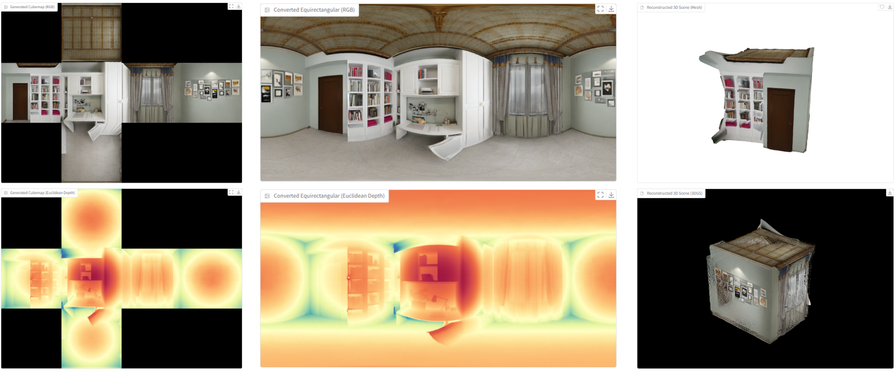

<h1 align="center">DreamCube: 3D Panorama Generation via Multi-plane Synchronization</h1>


<div align="center">
  
[](https://yukun-huang.github.io/DreamCube/)
[](https://arxiv.org/abs/xxxx.xxxxx)
[](https://huggingface.co/KevinHuang/DreamCube)

</div>

<p align="left">

<br>
<em>Multi-plane Synchronization</em> is a non-training strategy to adapt 2D diffusion models for multi-plane panoramic representations (e.g., cubemaps). Based on this strategy, we present <b>DreamCube</b>, a diffusion-based model for RGB-D cube map generation from single-view inputs.
</p>

## 📢 News
- [2025-06] 📢 Release [project page](https://yukun-huang.github.io/DreamCube/), [model weights](https://huggingface.co/KevinHuang/DreamCube), and [inference code](https://github.com/Yukun-Huang/DreamCube).

## ⚙️ Setup
Please refer to `requirements.txt`.

## 🕺 Inference
We provide inference scripts for generating RGB-D cubemaps and 3D scenes (both mesh and 3dgs) from single-view inputs. The trained model weights are automatically downloaded from [HuggingFace](https://huggingface.co/KevinHuang/DreamCube).

### - Using the Gradio Interface
```bash
bash app.py --use-gradio
```
It takes about 20 seconds to produce RGB-D cubemap, RGB-D equirectangular panorama, and corresponding 3D scenes (both mesh and 3dgs) on a Nvidia L40S GPU.
<p align="middle">

</p>

### - Using the Command Line
```bash
bash app.py
```
The results will be saved to `./outputs`.

## 👏 Acknowledgement
This repository is based on many amazing research works and open-source projects: [CubeDiff](https://cubediff.github.io/), [CubeGAN](https://diglib.eg.org/items/33594150-5a5d-4d36-9957-aa8c88d4c835), [PanFusion](https://github.com/chengzhag/PanFusion), [MVDiffusion](https://github.com/Tangshitao/MVDiffusion), [PanoDiffusion](https://github.com/PanoDiffusion/PanoDiffusion), [WorldGen](https://github.com/ZiYang-xie/WorldGen), etc. Thanks all the authors for their selfless contributions to the community!

## 😉 Citation
If you find this repository helpful for your work, please consider citing it as follows:
```bib
@article{huang2025dreamcube,
  title={{DreamCube: RGB-D Panorama Generation via Multi-plane Synchronization}},
  author={Huang, Yukun and Zhou, Yanning and Wang, Jianan and Huang, Kaiyi and Liu, Xihui},
  year={2025},
  eprint={},
  archivePrefix={arXiv},
  primaryClass={cs.CV},
}
```
